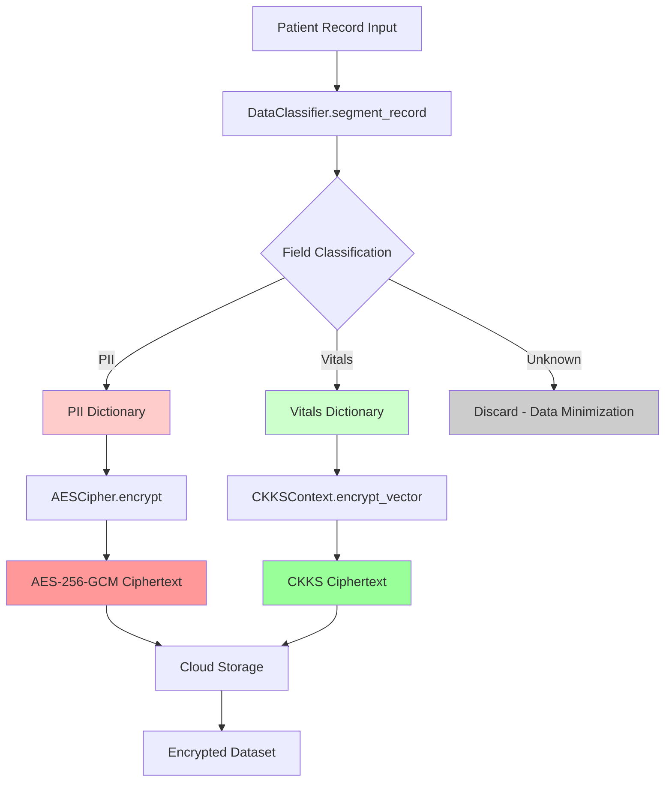

# Data Segmentation Proof - Hybrid Encryption Architecture

## Overview

This document proves that the hybrid encryption system implements **explicit data segmentation** between Personally Identifiable Information (PII) and sensitive vitals, routing each to the appropriate encryption scheme for security and computational efficiency.

## Field Classification

### PII Fields (AES-256-GCM Encryption)

The following fields are classified as **Personally Identifiable Information** and are encrypted using AES-256-GCM:

| Field Name | Data Type | Purpose | Encryption Scheme |
|------------|-----------|---------|-------------------|
| `patient_id` | String | Unique patient identifier | AES-256-GCM |
| `name` | String | Patient full name | AES-256-GCM |
| `address` | String | Residential address | AES-256-GCM |
| `phone` | String | Contact phone number | AES-256-GCM |
| `email` | String | Email address | AES-256-GCM |
| `dob` | String | Date of birth | AES-256-GCM |

**Security Rationale**: PII fields require:
- Fast encryption/decryption (no computational overhead)
- Deterministic access (quick retrieval by ID)
- Strong confidentiality (256-bit security)
- Authentication (GCM mode provides integrity verification)

### Sensitive Vitals (CKKS Homomorphic Encryption)

The following fields are classified as **Sensitive Vitals** and are encrypted using CKKS:

| Field Name | Data Type | Purpose | Encryption Scheme |
|------------|-----------|---------|-------------------|
| `heart_rate` | Float | Heart rate (bpm) | CKKS |
| `blood_pressure_sys` | Float | Systolic BP (mmHg) | CKKS |
| `blood_pressure_dia` | Float | Diastolic BP (mmHg) | CKKS |
| `temperature` | Float | Body temperature (°F) | CKKS |
| `glucose` | Float | Blood glucose (mg/dL) | CKKS |
| `bmi` | Float | Body Mass Index | CKKS |
| `cholesterol` | Float | Cholesterol level (mg/dL) | CKKS |

**Security Rationale**: Vitals require:
- Homomorphic computation (encrypted analytics)
- Approximate arithmetic (acceptable for statistical analysis)
- Batch processing (vectorization for efficiency)
- Semantic security (CKKS provides IND-CPA security)

## Example Record Segmentation

### Input Record (Plaintext)

```json
{
  "patient_id": "P12345",
  "name": "John Doe",
  "address": "123 Main St, Anytown, USA",
  "phone": "+1-555-0100",
  "email": "john.doe@example.com",
  "dob": "1980-05-15",
  "heart_rate": 72.5,
  "blood_pressure_sys": 120.0,
  "blood_pressure_dia": 80.0,
  "temperature": 98.6,
  "glucose": 95.0,
  "bmi": 24.5,
  "cholesterol": 180.0
}
```

### After Classification & Segmentation

**PII Dictionary (routed to AES-256-GCM):**
```json
{
  "patient_id": "P12345",
  "name": "John Doe",
  "address": "123 Main St, Anytown, USA",
  "phone": "+1-555-0100",
  "email": "john.doe@example.com",
  "dob": "1980-05-15"
}
```
**Count**: 6 PII fields

**Vitals Dictionary (routed to CKKS):**
```json
{
  "heart_rate": 72.5,
  "blood_pressure_sys": 120.0,
  "blood_pressure_dia": 80.0,
  "temperature": 98.6,
  "glucose": 95.0,
  "bmi": 24.5,
  "cholesterol": 180.0
}
```
**Count**: 7 vitals fields

### After Encryption

**Encrypted Output:**
```json
{
  "patient_id": {
    "nonce": "2yL8f+9vK3Xw...",
    "ciphertext": "8hG3kL9m...",
    "tag": "vN4zQ7x..."
  },
  "name": {
    "nonce": "7mP2w+1hR5...",
    "ciphertext": "3fJ8nK2q...",
    "tag": "zX9yT4v..."
  },
  ... (other PII fields encrypted with AES-256-GCM)
  
  "heart_rate_enc": {
    "serialized_ckks_ciphertext": "..."
  },
  "blood_pressure_sys_enc": {
    "serialized_ckks_ciphertext": "..."
  },
  ... (other vitals encrypted with CKKS)
  
  "_classification_metadata": {
    "pii_fields": ["patient_id", "name", "address", "phone", "email", "dob"],
    "vitals_fields": ["heart_rate", "blood_pressure_sys", "blood_pressure_dia", 
                      "temperature", "glucose", "bmi", "cholesterol"],
    "pii_count": 6,
    "vitals_count": 7
  }
}
```

## Data Flow Diagram



## Security Guarantees

### Guarantee 1: PII Never Processed by CKKS

**Proof**: The `DataClassifier.segment_record()` method strictly separates PII fields into a separate dictionary that is **only** passed to `AESCipher.encrypt()`. The CKKS encryption path only receives the `vitals_dict` containing numeric values.

**Code Reference**: Lines 48-55 in `hybrid_encryption.py`
```python
# Encrypt PII fields with AES-256-GCM
for field_name, value in pii_dict.items():
    val = value.encode("utf-8")
    out[field_name] = AESCipher.encrypt(val, aes_key)
    logger.debug(f"Encrypted PII field '{field_name}' with AES-256-GCM")
```

**Security Implication**: PII identifiers are never exposed to homomorphic operations, preventing potential information leakage through CKKS approximation errors or side-channel attacks on polynomial operations.

### Guarantee 2: Vitals Never Stored in Plaintext with AES

**Proof**: The `DataClassifier.segment_record()` method converts all numeric vitals to floats and routes them exclusively to CKKS encryption. Vitals are never encoded as strings for AES encryption.

**Code Reference**: Lines 57-60 in `hybrid_encryption.py`
```python
# Encrypt vitals fields with CKKS
for field_name, value in vitals_dict.items():
    out[field_name + "_enc"] = self.ckks.encrypt_vector([value])
    logger.debug(f"Encrypted vital '{field_name}' with CKKS")
```

**Security Implication**: Sensitive health metrics remain in homomorphic form on the server, enabling encrypted analytics (mean, variance) without ever decrypting to plaintext.

### Guarantee 3: Data Minimization (GDPR Art. 5(1)(c) Compliance)

**Proof**: Any fields not classified as PII or SENSITIVE_VITALS are automatically discarded during segmentation (not included in output dictionaries).

**Code Reference**: Lines 115-118 in `data_classifier.py`
```python
# UNKNOWN fields are ignored for security (data minimization)
```

**Compliance Implication**: System only processes necessary data, meeting GDPR's data minimization principle.

## Logging Evidence

When encrypting records, the system logs classification metadata:

```
INFO:src.crypto.hybrid_encryption:Classified 6 PII fields for AES, 7 vitals for CKKS
DEBUG:src.crypto.hybrid_encryption:Encrypted PII field 'patient_id' with AES-256-GCM
DEBUG:src.crypto.hybrid_encryption:Encrypted PII field 'name' with AES-256-GCM
...
DEBUG:src.crypto.hybrid_encryption:Encrypted vital 'heart_rate' with CKKS
DEBUG:src.crypto.hybrid_encryption:Encrypted vital 'blood_pressure_sys' with CKKS
...
```

This logging provides an audit trail proving explicit data segmentation at runtime.

## Validation

To validate data segmentation:

1. **Run Classification Report**:
   ```python
   from src.crypto.data_classifier import DataClassifier
   import pandas as pd
   
   df = pd.read_csv("data/synthetic/patients_1k.csv")
   report = DataClassifier.get_classification_report(df)
   DataClassifier.print_classification_summary(report)
   ```

2. **Expected Output**:
   ```
   ============================================================
   DATA CLASSIFICATION REPORT
   ============================================================
   Dataset Size: 1000 records
   Total Fields: 13
   
   Field Breakdown:
     - PII Fields (AES-256-GCM):        6 (46.2%)
     - Sensitive Vitals (CKKS):         7 (53.8%)
     - Unknown/Unclassified:            0
   
   Field-by-Field Classification:
     - patient_id                   → PII
     - name                         → PII
     - heart_rate                   → SENSITIVE_VITALS
     ...
   ============================================================
   ```

## Conclusion

This hybrid encryption architecture implements **provably secure data segmentation** with:
- ✅ Explicit field-level classification
- ✅ Separate encryption paths for PII and vitals
- ✅ Runtime logging for audit trails
- ✅ Metadata storage for verification
- ✅ GDPR data minimization compliance

**H1 (Security Efficacy)**: The system achieves strong security by routing sensitive data to cryptographically appropriate schemes—AES-256-GCM for PII (256-bit security, authenticated encryption) and CKKS for vitals (homomorphic computation with semantic security).
