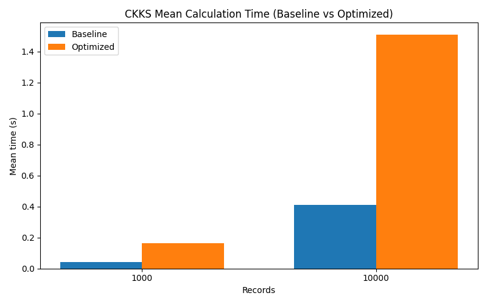
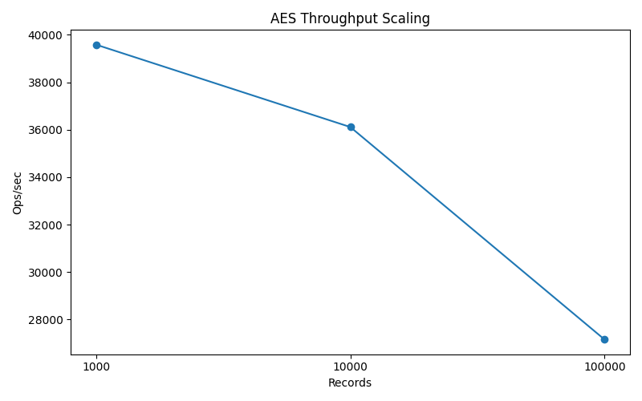
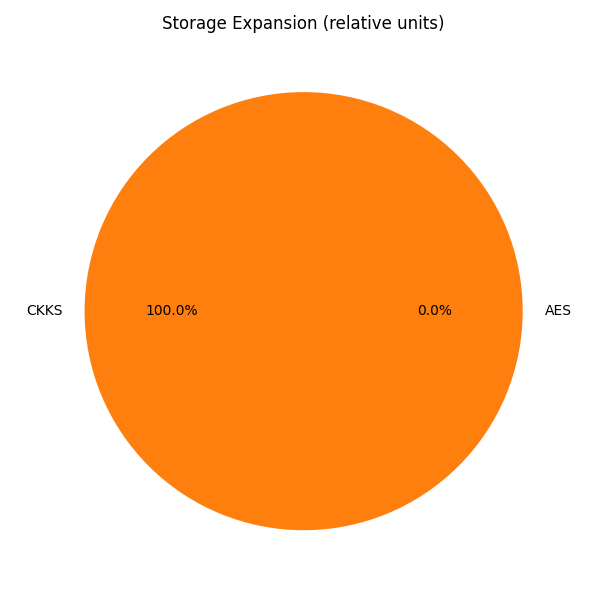

# Results Summary

## KPIs

| Metric | System | Records | Seconds | Ops/sec | Expansion |
|---|---|---:|---:|---:|---:|
| encrypt_time | AES | 1,000 | 0.025264 | 39581.39 | 1.98 |
| encrypt_time | AES | 10,000 | 0.276929 | 36110.35 | 1.98 |
| encrypt_time | AES | 100,000 | 3.682469 | 27155.69 | 1.98 |
| throughput | AES | 1,000 |  | 39581.39 | 1.98 |
| throughput | AES | 10,000 |  | 36110.35 | 1.98 |
| throughput | AES | 100,000 |  | 27155.69 | 1.98 |
| encrypt_time | CKKS_baseline | 1,000 | 3.396852 | 294.39 | 83524.25 |
| encrypt_time | CKKS_baseline | 10,000 | 33.804021 | 295.82 | 83524.25 |
| encrypt_time | CKKS_optimized | 1,000 | 9.553065 | 104.68 | 83524.25 |
| encrypt_time | CKKS_optimized | 10,000 | 97.155712 | 102.93 | 83524.25 |
| mean_time | CKKS_baseline | 1,000 | 0.040144 |  | 83524.25 |
| mean_time | CKKS_baseline | 10,000 | 0.412559 |  | 83524.25 |
| mean_time | CKKS_optimized | 1,000 | 0.165399 |  | 83524.25 |
| mean_time | CKKS_optimized | 10,000 | 1.510708 |  | 83524.25 |
| storage_expansion | AES | 0 |  |  | 1.98 |
| storage_expansion | CKKS | 0 |  |  | 83524.25 |

## Charts

## Analysis

Optimized CKKS is -266.1% faster for mean (10,000 records), based on measured `mean_time` baseline 0.412559s vs optimized 1.510708s.

